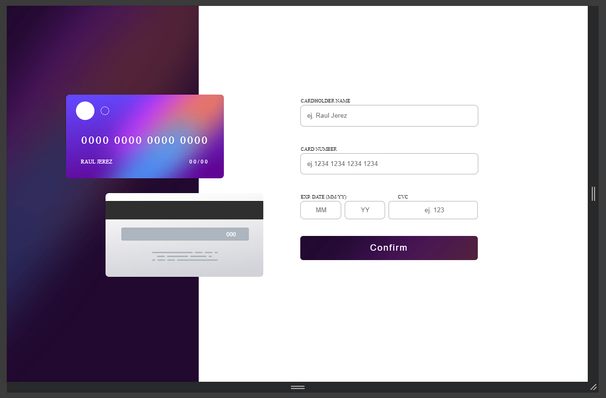
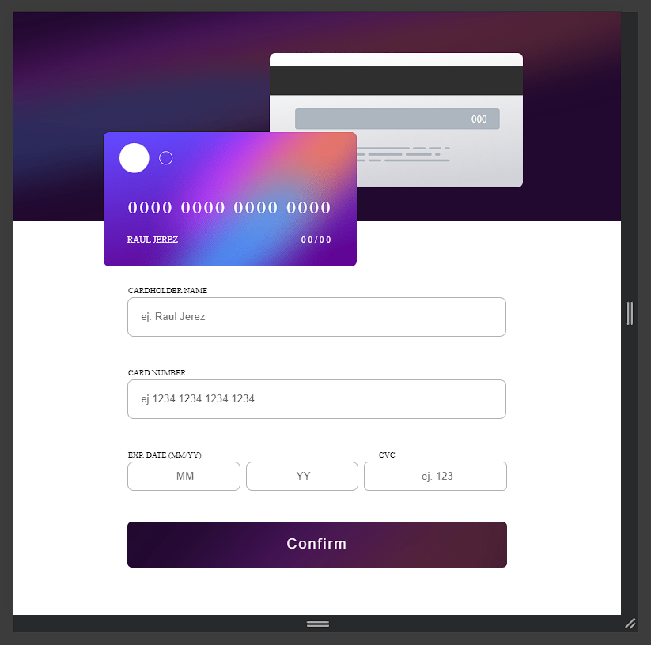
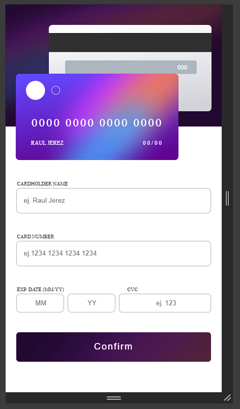
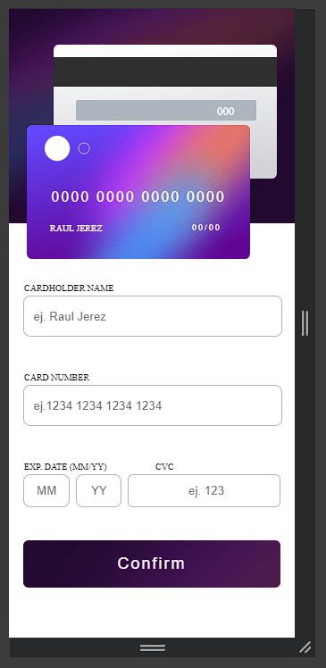
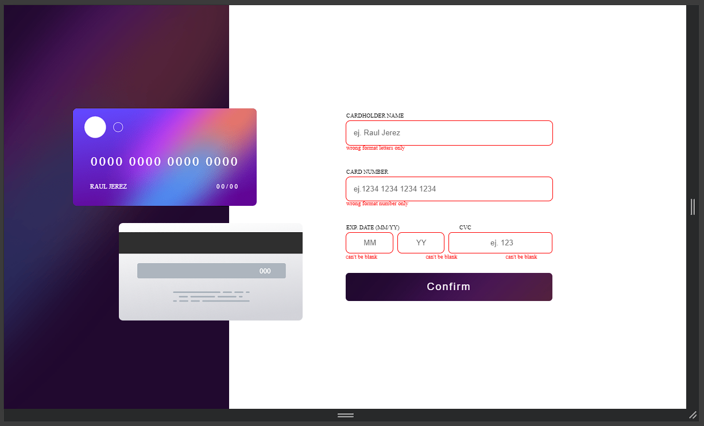

# 💳 Credit card

## 👋 Bienvenido! 👋

😍 Gracias por visitar mi repositorio de Credit Card!

🛠 **Creado con Html + Css + JavaScript**

⚡ Proyecto totalmente "Responsive".

<br/>

## 🖼 imagenes de la aplicación.

   

   

  

<br/>

## Pasos para ejecutar el proyecto:

- Clonar el proyecto en tu máquina local

```batch
 git clone https://github.com/Rauljp16/frontend-mentor.git
```

- Abrir el proyecto algún editor de código (Visual Studio Code, Sublime Text, etc)
